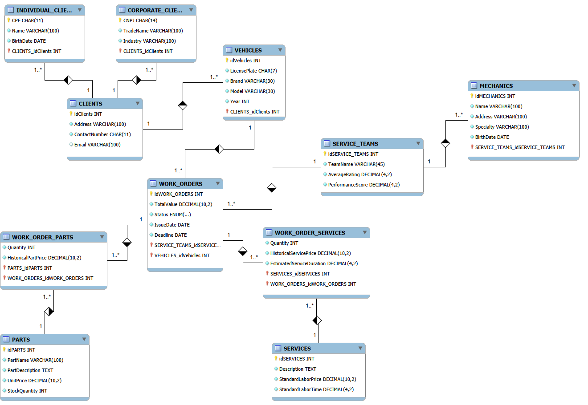

# Auto Repair Shop Management System

> **A robust, normalized relational database schema engineered to manage the complex operations of an Automotive Service Center.**

---

## Database Schema (EER Diagram)

   

---

## Project Overview

This project simulates a production-grade database for a high-volume **Auto Repair Shop**. Unlike basic academic models, this schema addresses real-world business pains such as **financial consistency**, **client inheritance**, and **performance tracking**.

The architecture was designed to answer critical business questions:
* *"How much did we charge for this part 6 months ago?"* (Historical Pricing)
* *"Which mechanic team has the best customer rating?"* (Quality Assurance)
* *"What is the difference in revenue between Corporate Fleets and Individual Clients?"* (Segmentation)

## Key Features & "Senior" Decisions

* ** Financial Integrity (Price Freezing):** Implemented logic to store `HistoricalPartPrice` and `HistoricalServicePrice` within order items. This ensures that future price updates in the catalog do not corrupt the financial history of past Work Orders.
* ** Client Inheritance Strategy:** Utilized a **Generalization/Specialization** approach for `Clients`, branching into `IndividualClients` (CPF) and `CorporateClients` (CNPJ/Industry), sharing a common ID space for simpler querying.
* ** Operational Efficiency:** Includes `EstimatedServiceDuration` to allow future analysis of "Planned vs. Actual" efficiency metrics.
* ** Quality Metrics:** Integrated `AverageRating` at the Team level to enable performance-based analytics.
* ** Strict Typing:** utilized specific data types (`DECIMAL` for currency/time, `ENUM` for finite states) to ensure data hygiene at the database level.

---
